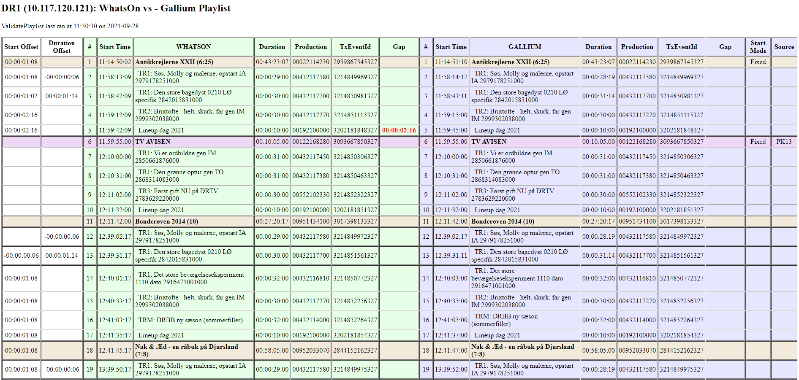

# pp-validate-playlist

## Introduction

pp-validate-playlist is a NodeJS application running on PP01 which is run periodically (every 10 minutes) via Task Scheduler. It reads Gallium playlists and compares them with schedules in WhatsOn. It then creates side-by-side HTML tables for each channel highlighting differences between WhatsOn and Gallium. This is used by operators to validate that Gallium playlists are in sync with WhatsOn.

pp-validate-playlist is **not** a critical application, so SCOM alerts need not be addressed immediately.

- **First responder**: Alastair MacMaster [ALAM] 
  - Investigate cause of crash, resolve and fix
- **Second responder**: Jabob Viggo Hansen [JVH] or Ole Kristensen [DREXOLEK]
  - Assuming Alastair is unavailable

---

## Application overview

- **Server**: PP01
- **Run via**: Task Scheduler
- **Triggers**: Runs periodically (every 10 minutes)
- **Start in**: ```c:\node\pp-validate-playlist```
- **Execute**: ```node app.js```
- **User**: NET\svcPP01
- **HTML tables**:
    - ```\\pp01\system$\Monitoring\pp-validate-playlist\DR1.html```
    - ```\\pp01\system$\Monitoring\pp-validate-playlist\DR2.html```
    - ```\\pp01\system$\Monitoring\pp-validate-playlist\TVR.html```
    - ```\\pp01\system$\Monitoring\pp-validate-playlist\TSK.html```
    - ```\\pp01\system$\Monitoring\pp-validate-playlist\EVA.html```
    - ```\\pp01\system$\Monitoring\pp-validate-playlist\EVB.html```
    - ```\\pp01\system$\Monitoring\pp-validate-playlist\EVC.html```
- **Logs**: ```\\PP01\system$\Logs\pp-validate-playlist```
- **GitHub repo**: https://github.com/drdk/pp-validate-playlist.git
- **PDF source**: https://github.com/drdk/pp-validate-playlist/blob/main/README.md

---

### Example output for DR1



---

## Failure resolution

If the pp-validate-playlist app fails to run, first check that the application is being triggered by Task Scheduler:

- Connect to PP01 via **PAM**
- Run **Task Scheduler** and select **pp-validate-playlist** in the applications list
- Click **Run** in the **Actions** panel.
- The status should show **Running** for a few seconds inside the application list if the application runs correctly - (you may need to click F5 to refresh) - and will then return to **Ready** after the application completes.
- If pp-validate-playlist failed to run, locate the last logfile and look for any obvious failure. The logfile should end with **Application completed successfully**

If the pp-validate-playlist application will **NOT** run after these steps, contact the second responder to help analyse the problem.

---

## Redundancy

PP01 is a virtual machine and so can be restarted quickly with files rolled back several days if necessary.
